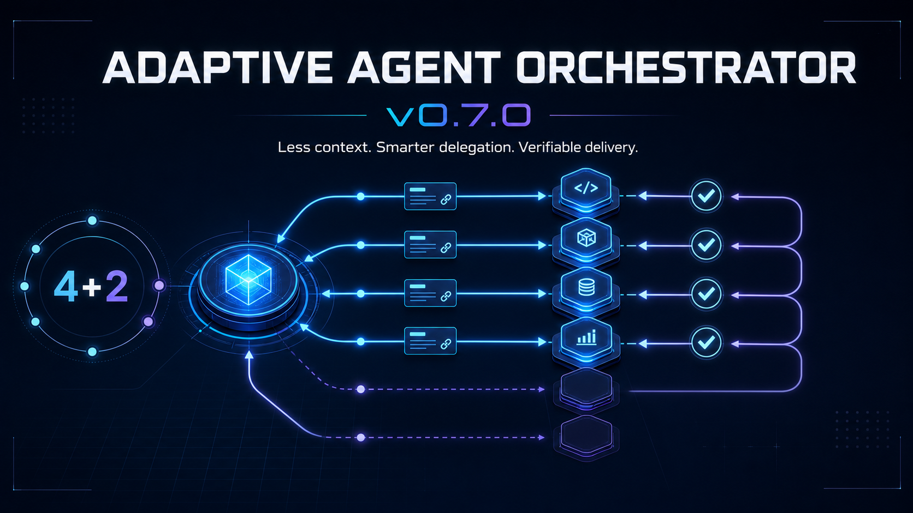

# Adaptive Agent Orchestrator

[English](README.md) · [v0.7.2 正式版说明](docs/releases/v0.7.2.md) · [版本历史](docs/releases/README.md) · [安装](#安装) · [工作原理](#工作原理) · [当前限制](#当前限制)



`adaptive-agent-orchestrator` 是一个适用于研究、开发、写作、分析、创意和
运营任务的 Codex Skill。主 Agent继续承担主线生产，只把可隔离、可验收且
值得并行的工作交给临时 subagent 或长期独立任务，从而减少重复读取、重复
推理和等待时间。

目标是降低完整任务的总 Token 消耗。用户不需要配置 Token budget；Skill
也不会假装能预测一个开放式持续改进任务的最终消耗。节省效果必须由公平的
端到端 benchmark 证明。

## 为什么值得使用？

- **减少上下文复制：** Worker 接收路径、来源 ID、产物指针和必要片段，
  而不是重复复制完整对话。
- **限制上下文选择：** 项目根目录、全部文件等宽泛占位引用会被拒绝；可选
  的选择理由只留在主 Agent 控制面，不进入 Worker prompt。
- **渐进披露：** Skill 正文保持精简；reference 和项目文件只在当前工作流
  真正需要时读取。
- **默认单 Agent：** 小任务、强顺序、高上下文重叠和窄范围修改留在主
  Agent。
- **值得时使用长期任务：** 独立、有边界、可验收，且能使用更小上下文或
  更低成本模型的工作会主动建议创建可见的 Codex 长期任务，而不是静默留在
  昂贵的主上下文中。
- **动态工作所有权：** 主 Agent负责全局主线与最终整合；任务入口和关键
  事件点重新判断哪些工作自己做、临时委派、长期负责、暂缓或停止。
- **0–2 个首波 Worker：** 简单任务不派；一个独立工作面派一个；两个同时
  就绪且上下文完全分离的工作面最多并行两个。
- **独立上下文：** 原生 subagent 默认不继承完整对话，只接收紧凑任务包和
  稳定引用；大量日志、资料和搜索结果留在其独立上下文。
- **直接 Worker 快速路径：** 单个临时只读 Worker 不创建持久计划、日志或
  存储角色，也不创建缩小版状态机。
- **创建过程可见：** 每个 Worker 创建前都说明角色和必要性，创建后报告
  真实身份与状态；选择角色本身不会自动创建 Worker。
- **创建结果核对：** 后台创建调用无论返回成功还是错误，都要用任务列表
  核对真实实体；未知状态不会触发盲目重试，重复实体会被识别并停止扩张。
- **结果回收门：** 独立后台 Agent 的最终回答必须被显式读取并生成哈希回执，
  否则必需节点不能通过完成门。
- **长期审核闭环：** 长期研究或 Skill 研发可在多个里程碑复用只读领域角色
  与反方角色；主 Agent仍是唯一 Writer，并必须逐项回应每份审核发现。
- **独立来源不可互替：** 每个审核来源保留自己的报告、证据、处置与复审义务；
  一个来源不能替代另一个，未解决 P0/P1 始终阻断完成。
- **final 缺失恢复：** 任务显示 completed 却没有 final 时进入
  `result_pending`，绝不当作成功。同一来源最多进行三次有界回收；替代角色
  必须经过主控授权，并保持来源、角色、checkpoint、input 和恢复链连续性。
- **诚实接入旧任务：** 对旧任务只捕获真实存在的角色、checkpoint、input、
  turn 与授权材料；平台从未提供的机器身份字段明确标为 unknown，不补造。
- **不可信结果边界：** 主 Agent 的控制面政策把 Worker 输出视为不可信数据，
  而不是直接授权；已验证、推断和假设类发现采用不同的复核与采纳规则。
- **回执绑定归档：** durable task 的结果回执消失或被修改后，不能进入归档。
- **派遣前预览：** 可在创建持久 Worker 前查看角色、拓扑、模型、权限、引用
  数量和初始任务包字符量，但不会把字符数冒充 Token 或金额。
- **平台观测校准：** 项目内追加保存去标识化的 reconciliation 区间观测，
  按运行环境分组提供诊断；现有证据不足时明确抑制窗口建议。
- **受保护的活动容量：** 目标最多六个活动 Worker，其中四个可供常驻
  Worker 使用，另外两个保留给临时 subagent；实际数量服从运行时容量。
- **静态模型路由：** Luna 处理边界明确的机械任务，Sol 负责判断、写作、
  实现和审查；Terra 只在用户明确指定时使用，正式任务前不会额外启动模型
  测试 Agent。
- **确定性模式：** `auto` 在轻量快速路径、独立团队和可恢复工作流之间
  选择，不创建额外调度 Agent。
- **可复用研究证据：** 只有多条下游工作流需要复用同一来源集时，才按需
  启用资料整理角色。
- **行业角色按需加载：** 内置部分行业角色包，只加载被选中的合同；后续
  扩展行业时也不会把全部角色塞入每个 Worker 的上下文。
- **通用产物所有权：** 专业 Worker可拥有边界明确的章节、模块、调查、
  数据集或设计面；缺陷返回原所有者，主 Agent保持全局主线和最终合并。
- **轻量项目知识：** 只有长期或跨工作流复用时才保存决策、已验证事实、
  接口和未解决风险；普通一次性任务不创建知识库。
- **明确角色寿命：** 一次性、项目级和用户拥有角色不会混在一起；用户明确
  要求复用的角色不会被系统自动降级或删除。
- **按风险审阅：** 低风险跳过 Reviewer；中风险抽查关键输出；高风险才使用
  一个独立 Reviewer。
- **差量重试：** 只传原产物指针、失败证据和修复指令，不重放整个任务包；
  只有同一哈希计划中已记录为失败的同一节点才能进入差量模式；确定性失败
  后再次创建 Worker 必须绑定该失败事件并由用户确认。
- **单一总控：** Worker 不能递归创建 Worker。
- **可恢复执行：** 不可变计划、哈希链事件、仅在恢复/复用需要时生成的
  handoff、写入范围检查和可执行完成门。

## 设计参考

v0.4 从 GitHub 一手来源中只吸收狭窄、可验证的机制：

- [Agent Skills specification](https://github.com/agentskills/agentskills)：
  metadata → Skill 正文 → 按需资源的渐进披露；
- [OpenAI Skill Creator](https://github.com/openai/skills/blob/main/skills/.system/skill-creator/SKILL.md)：
  Skill 只保留任务必需指令，脚本无需读入模型上下文即可执行；
- [Supabase Agent Skills guidance](https://github.com/supabase/agent-skills/blob/main/AGENTS.md)：
  每一段文字都必须证明自己的 Token 价值，高级细节放入 references；
- [Superpowers parallel-agent guidance](https://github.com/obra/superpowers/blob/main/skills/dispatching-parallel-agents/SKILL.md)：
  只拆独立问题域，并隔离 Worker 上下文；
- [Acontext](https://github.com/memodb-io/Acontext)：按需读取明确的 Skill
  文件，而不是把不透明记忆注入每次上下文；
- [oh-my-codex](https://github.com/Yeachan-Heo/oh-my-codex)：把 economy
  路由作为产品目标。

我们明确不照搬冗长强制思考仪式、实时 DAG 重写、多 Reviewer ensemble、
完整日志回灌或面向用户的 Token budget。GPT‑5.6 本来就会普通拆分和工具
选择，重复教学只会增加过度思考和上下文成本。

## 包含文件

```text
skills/adaptive-agent-orchestrator/
├── SKILL.md          # 精简运行规则
├── agents/           # Codex 展示元数据
├── references/       # 只在相关路径按需加载的合同
└── scripts/          # 确定性校验、状态和诊断工具
```

## 安装

对 Codex 说：

```text
$skill-installer install https://github.com/Gabrielzzh/adaptive-agent-orchestrator/tree/main/skills/adaptive-agent-orchestrator
```

安装后重启 Codex。手动安装时，把完整
`skills/adaptive-agent-orchestrator` 目录复制到
`$HOME/.codex/skills/adaptive-agent-orchestrator`。确定性脚本需要
PowerShell 7.5 或更高版本。

## 快速开始

```text
只有当这个迁移任务包含真正独立的工作流时，才使用
$adaptive-agent-orchestrator。共享上下文留在主 Agent，Worker 只拿引用，
并且渐进派遣。
```

```text
使用 $adaptive-agent-orchestrator 创建一个需求预测 Reviewer 角色。派遣前
协助我定义身份、非目标、证据规则、提问条件和升级条件。
```

```text
使用 $adaptive-agent-orchestrator 完成这个供应链研究。先展示精简角色图，
说明哪些职责由主 Agent 承担；没有自动组队授权的 Worker 必须先征得我同意。
```

```text
使用 $adaptive-agent-orchestrator 从计划和事件日志恢复中断的工作流，不要
重放失败上下文。
```

## 与官方 Codex subagent 的区别

官方 subagent 是执行原语；本 Skill 是它上面的上下文效率和治理层，不替代
官方功能。

| 能力 | 官方 subagent | Adaptive Agent Orchestrator |
| --- | --- | --- |
| 一次性委派 | 原生、更简单 | 主动让路 |
| 上下文选择 | 依赖总控判断 | 引用优先、排除项、重叠检查 |
| 派遣时机 | Prompt 驱动 | 动态所有权判断，首波0–2个独立Worker |
| 审阅 | 依赖总控判断 | 按风险或抽样，不默认多 Reviewer |
| 重试 | 依赖当前会话 | 差量修复任务包与失败分类 |
| 写入所有权 | 依赖 Prompt/沙箱 | 执行前拒绝重叠 Writer |
| 恢复 | 线程历史与摘要 | 哈希计划、追加日志、不可变 handoff |
| 完成判断 | 主 Agent 汇总 | 节点、产物、证据和人工门检查 |
| Token 节省 | 不自动测量 | 离线端到端 benchmark 门 |

短而明确的委派直接用官方 subagent。协调本身会制造风险或重复上下文时，
再使用本 Skill。

## 工作原理

```text
请求
  ↓
主 Agent取得全局主线和自己的生产工作
  ↓
寻找可用更小上下文独立完成的工作面
  ↓
按需要启动0–2个首波Worker
  ↓
主 Agent继续生产并验证Worker证据与产物
  ↓
只有产生新采纳价值时才启动后续波次
  ↓
按风险审阅 + 主 Agent 直接整合
  ↓
产物、证据和人工决策完成门
```

脚本负责结构和生命周期状态校验。Codex 主 Agent 仍负责选择可用执行工具、
创建 Worker、读取真实线程、整合结果和执行已授权的外部动作。

## 验证情况

v0.7.2 正式版本通过：

- 33 个 PowerShell 脚本语法解析；
- 30 项恢复协议专项断言；
- 601 项完整自测断言；
- 57 份故意构造的非法负面案例均被正确拦截；
- 8 个 reference JSON 文件严格解析；
- 计划、元数据、日志、handoff、依赖、幂等、所有权、上下文重叠、渐进
  派遣、短任务包、长期任务选择、排队创建、worktree 预检、任务收据、
  长期审核、结果恢复、替代连续性和完成门测试；
- 严格 JSON 解析与真实 Windows Junction/reparse point 实体测试；
- Skill Creator 校验；
- 同一独立审核角色对两项发布阻断绕过完成动态复攻，最终 GREEN，
  P0/P1/P2 均为 0。

```powershell
pwsh -NoProfile -File `
  .\skills\adaptive-agent-orchestrator\scripts\Test-Self.ps1
```

## 当前限制

- 这是治理 Skill，不是独立 Agent 托管平台。
- Skill 不修复平台自身的 `systemError` 或 final 丢失；它保证这些状态不会
  被误报为成功，并使恢复与替代连续性可核验。
- 自然语言排除项无法删除宿主已经注入的历史；应使用 fresh Worker 和明确
  输入引用。
- 精确重叠检查无法发现“不同名称但语义相同”的材料，主 Agent 仍需拒绝。
- 不同项目之间没有共享机器级校准账本；根任务总上限由主 Agent 执行，
  恢复后必须先核对可见状态再继续创建 Worker。
- 校准账本记录的是快照观测区间，不是精确平台可见延迟。
- 只有执行面提供 telemetry 时，Token 用量才可用于诊断。
- 中位数节省 20% 是发布 benchmark 目标，不是已经证实的生产声明；合成
  测试不能证明真实 Token 节省。
- Windows 符号链接夹具因当前环境不允许创建链接而跳过。
- 当前只在 Windows 10 + PowerShell 7.6.3 动态验证，macOS/Linux 尚未
  动态验证。

## 安全模型

Skill 拒绝递归委派、Writer 范围重叠、不安全路径、伪造运行元数据、日志
篡改、未验证 handoff 哈希，以及没有用户证据的人工门完成。发布、删除、
支付、账号修改和生产操作仍由主 Agent 持有，并需要用户授权。

## 贡献

见 [CONTRIBUTING.md](CONTRIBUTING.md)。优先提交可复现失败案例和紧凑测试。

## License

MIT，见 [LICENSE](LICENSE)。
